{{toc}}

freertpsを使用したMCUへのROS2実装デモ
====================================

デモの概要
----------
ルネサスのRX63Nが搭載されたArduino互換ボード（GR-SAKURA II-FULL）を使用してROS2を実装したデモです。

参考：
ROSCon2017でのライトニングトークプレゼン
https://roscon.ros.org/2017/presentations/ROSCon%202017%20Lightning%20110.pdf
https://vimeo.com/236129109

RX63N
https://www.renesas.com/ja-jp/products/microcontrollers-microprocessors/rx.html

GR-SAKURA II-FULL
http://gadget.renesas.com/ja/product/sakura.html


ここでは、GR-SAKURA II-FULL上で動作するfreertpsを使って、デモを実行する手順を示します。

* Hello worldデモ
  ROS2の文字列用メッセージ型"std_msgs::msg::String"の送受信デモ

* Tilt Controlデモ
  ROS2のJoystick用メッセージ型"sensor_msgs::msg::Joy"を使ったJoystickによるパンチルト台の制御デモ


デモ実行環境
------------

デモの実行に必要な項目は以下のとおりです。

### **\[ハードウェア\]**

(1) GR-SAKURA II-FULL 2枚
作成したイメージが動作するターゲットボード。2枚のGR-SAKURA II-FULL（以降、SAKURA）が必要です。以下で購入が可能です。

http://wakamatsu.mobi/eccube/html/products/detail.php?product_id=12010659
http://jp.rs-online.com/web/p/processor-microcontroller-development-kits/1229826/

* SAKURA(Pub): メッセージを送信するボード。Joystickシールドを取り付けて使用します。
* SAKURA(Sub): メッセージを受信するボード。パンチルト台をUART接続して使用します。

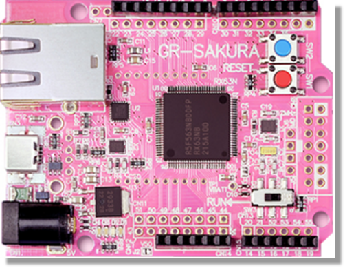

(2) Joystickシールド
SAKURA(Pub)に接続するArduinoシールドです。以下などで購入が可能です。
https://www.sainsmart.com/products/sainsmart-joystick-shied-expansion-board-for-arduino

このシールドはSAKURAに直接搭載するとRJ45ポートと干渉します。ピンヘッダーなどで回避してください。

(3) パンチルト台
このアプリのために作成したパンチルト台です（市販品ではありません）。パンチルト台制御アプリ（後述）がJoystickの位置情報をモーターの目標角度に変換し、それに従いパンチルト台が動作します。

(4) Ethernet HUB
SAKURA間をLAN接続するために必要です。

(5) E1 Emulator (オプション)
RX63Nで使用可能なICEデバッガです。
Hello worldデモにおいて、受信側のデバッグ・コンソールを出力する場合に必要となります。

このデモでは、上記(1)〜(5)の機器は以下のように接続されます。

```
 +---------------------+
 |    Joystick         |
 +---------------------+
         | Arduino Shield I/F
 +---------------------+           +-----------------+
 |   SAKURA(Pub)       +-----------+  Ethernet HUB   |
 +---------------------+  Ethernet +-------+---------+
   192.168.1.100                           |
                                           |
   192.168.1.101                           |
 +---------------------+                   |
 |   SAKURA(Sub)       +-------------------+
 +---------------------+  Ethernet
         | UART                                
 +---------------------+
 |  パンチルト台        |
 +---------------------+
```

### **\[ソフトウェア\]**

(1) C/C++ Compiler Package for RX Family

無償評価版を以下からダンロードします。インストール方法についてはWebページ上のドキュメントを参照してください。

https://www.renesas.com/ja-jp/software/D4000427.html

なお、無償評価版には機能、リンクサイズに制限がありますのでwebでの確認をお願いします。
動作確認を行ったバージョンは「V.6.00.00」です。

(2) Flash Development Toolkit 

無償評価版を以下からダンロードします。インストール方法についてはWebページ上のドキュメントを参照してください。

https://www.renesas.com/ja-jp/software/D3017333.html

動作確認を行ったバージョンは「V.4.09 Release 03」です。

ソースコードの取得と展開
------------

(1) 以下のソースコードを入手し、任意のディレクトに展開します。

RXファミリ 組み込み用TCP/IP M3S-T4-Tinyを用いたサンプルプログラム Firmware Integration Technology
https://www.renesas.com/ja-jp/software/D6000791.html

(2) 展開したディレクトリ内の以下のファイルを編集します。

```
workspace/sample/rx63n_gr_sakura/r_config/r_bsp_config.h
```

UARTへの供給クロックを変更するため、以下のマクロ BSP_CFG_PCKB_DIVの値を(4)から(2)に変更します。これは今回使用するパンチルト台とのUART通信で１Mbpsの設定を使用するためのもので、UART通信の仕様に合わせて変更します。


```c
    /* Peripheral Module Clock B Divider (PCKB).
      Available divisors = /1 (no division), /2, /4, /8, /16, /32, /64
    */
    #define BSP_CFG_PCKB_DIV                (2)
```


(3) 以下のURLよりRX63N版のfreertpsを入手します。
https://github.com/godzilla-max/freertps/archive/master.zip
上記アーカイブは以下のディレクトリ内で展開してください。

```
    workspace/sample/rx63n_gr_sakura/
```

(4) 以下のURLよりデモアプリケーションで使用するUARTドライバを入手します。
https://github.com/godzilla-max/uart/archive/master.zip
上記アーカイブは以下のディレクトリ内で展開してください。

```     
    workspace/sample/rx63n_gr_sakura/
```


(1)〜(4)の手順で作成されるディレクトリ構造は以下のとおりです。

```
    workspace/sample/rx63n_gr_sakura/ [TCP/IP M3S-T4-Tiny を用いたサンプルプログラム]
    |
    |-- freertps/                     [RX63N版 freertpsのコード一式]
    |   |
    |   |-- apps/ [FreeRTPSを利用するアプリのサンプル]
    |   |   |-- ...(SNIPPED)...
    |   |   |-- rx63n_gr_sakura_joystick/ [Joystick制御アプリ]
    |   |   |-- rx63n_gr_sakura_listener/ [文字列"Hello world"の受信アプリ]
    |   |   |-- rx63n_gr_sakura_talker/   [文字列"Hello world"の送信アプリ]
    |   |   |-- rx63n_gr_sakura_tilt_ctrl/[パンチルト台制御アプリ]
    |   |   |-- ...(SNIPPED)...
    |   |
    |   |-- include/
    |   |-- psm/
    |   |-- r2/
    |   |-- ros2_demos/
    |   |-- rosmsg_apps/
    |   |-- scripts/
    |   |-- systems/
    |   |   |-- ...(SNIPPED)...
    |   |   |-- rx63n_gr_sakura/      [freertps RX63N + M3S-T4-Tiny依存部分]
    |   |   |-- ...(SNIPPED)...
    |   |-- tests/
    |   |-- tiny/
    |   `-- utils/
    |-- HardwareDebug/
    |-- r_bsp/
    |-- r_cmt_rx/
    |-- r_config/
    |-- r_ether_rx/
    |-- r_pincfg/
    |-- r_sys_time_rx/
    |-- r_t4_driver_rx/
    |-- r_t4_rx/
    |-- src/
    `-- uart/                         [UARTドライバ]
```

ファームウェアのビルド方法
------------

(1) SAKURA(RX63N）用にビルドを行います。

詳細は以下に記載されていますが、RX63N用にCS+プロジェクトに変換します。
RX ファミリ 組み込み用TCP/IP M3S-T4-Tiny を用いたサンプルプログラム（第５章）
https://www.renesas.com/ja-jp/doc/products/mpumcu/apn/rx/002/r20an0312jj0106-rx-t4.pdf

RX63Nプロジェクト変換では、以下のように設定します。マイクロコントローラの品番が違うこと、命令セット・アーキテクチャの設定を変更しないことに注意してください。

(1-1) CS+ for CC を起動し、「e2 studio / CubeSuite / …」の「GO」ボタンを押します。

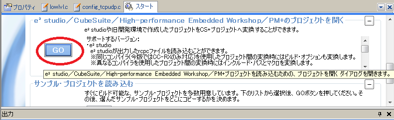

初回以降にCS+ for CCが起動されることで、上記の画面が出力されない場合は、画面内の以下のボタンをクリックしてください。

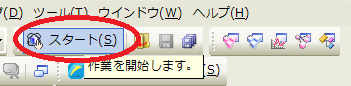

(1-2) 「プロジェクトを開く」の画面内で、以下のように「rx63n_gr_sakura.rcpc」を選択してください。
    
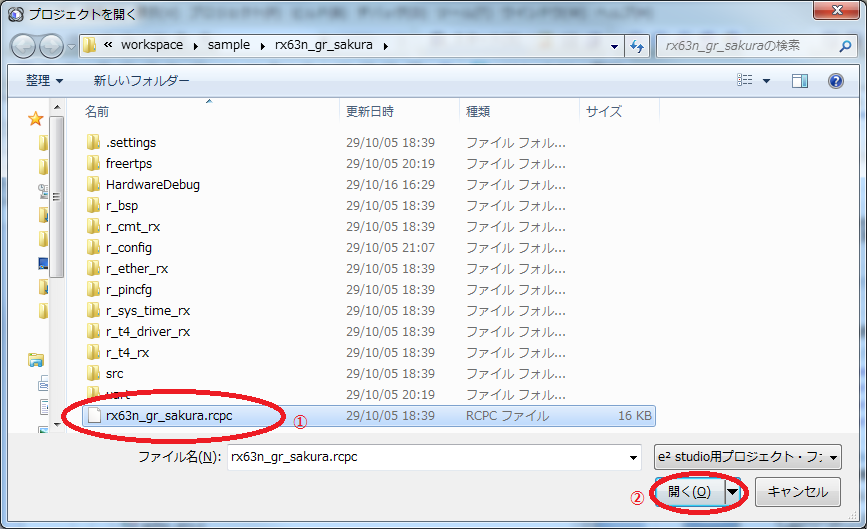
    

(1-3) 「プロジェクト変換設定」ウインドウが開き、ツリー上でプロジェクトを選択します。

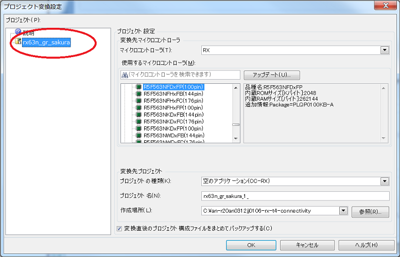

(1-4) ツリーの右側のプロジェクト設定で、使用するマイクロコントローラを「RX63N」->「R5F563NYDxFP」を選択して「OK」を押します。CS+は変換されたプロジェクトを出力します。

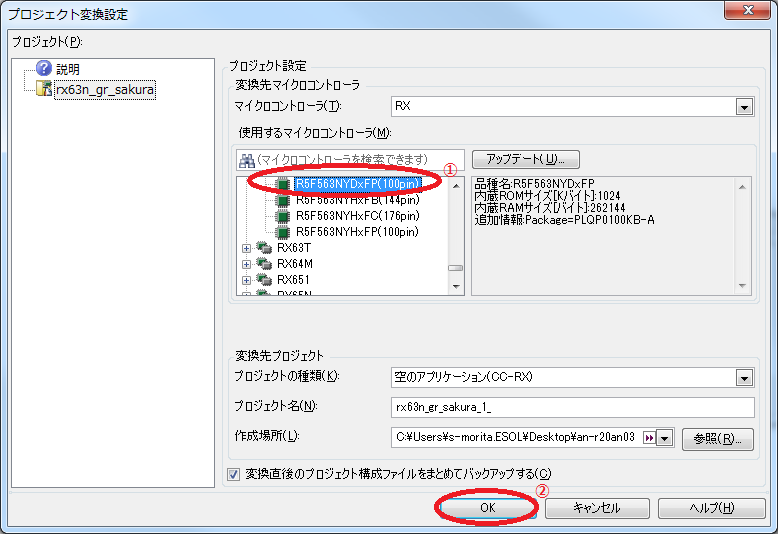

以下のようなダイアログが出力された場合は、「いいえ」をクリックしてください


(1-5)「プロジェクトツリー」から「CC-RX」を選択します。

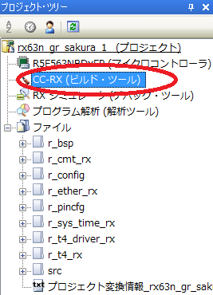

(1-6)「共通オプション」タブ->「CPU」->「命令セット・アーキテクチャ」は変更しません。

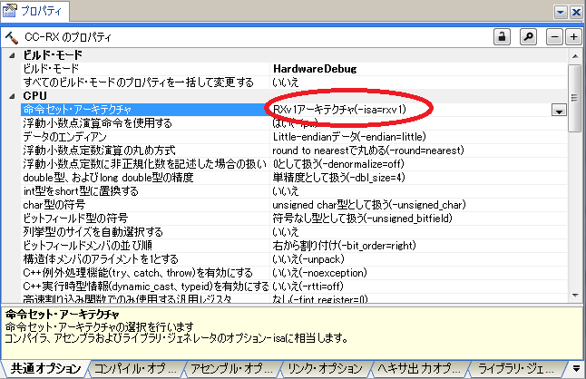

(1-7)「共通オプション」タブ->「よく使うオプション(コンパイル)」->「最適化レベル」を"0"に設定してください。

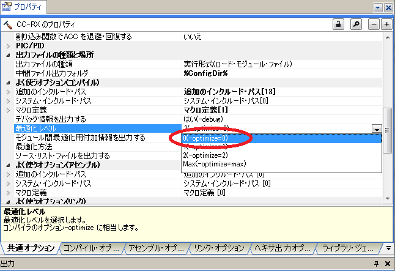

(2) src/以下のファイルをすべてビルド対象外とするため、「プロジェクトツリー」の「ファイル」->「src」上で「右クリック」->「プロパティ」を選択後、「ビルドの対象とする」を「いいえ」に設定します。

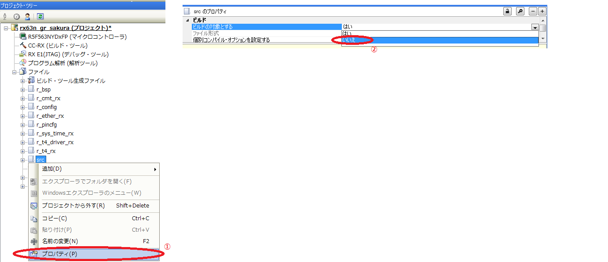

(3) 以下のディレクトリを「ファイル」上にドラッグ＆ドロップしてください。

```
workspace/sample/rx63n_gr_sakura/uart
```

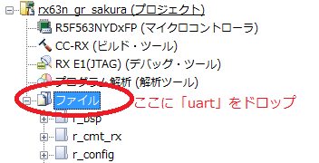

「フォルダとファイル追加」の画面では、「検索するサブフォルダの階層数」に十分深い階層数として"10"を設定して、「OK」をクリックしてください。

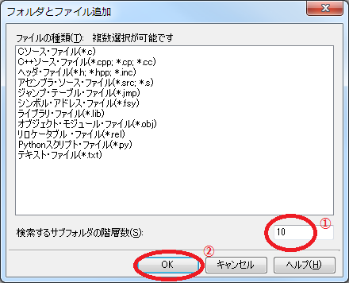

(4) 「ファイル」上で「右クリック」->「新しいカテゴリを追加」を選択後、「freertps」と入力してください。

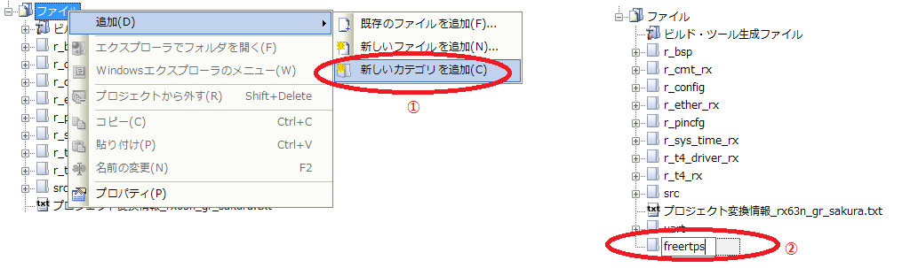

(5) 以下のディレクトリ・ファイルを「ファイル」->「freertps」上にドラッグ＆ドロップしてください。

```
workspace/sample/rx63n_gr_sakura/freertps/apps
workspace/sample/rx63n_gr_sakura/freertps/include
workspace/sample/rx63n_gr_sakura/freertps/systems
workspace/sample/rx63n_gr_sakura/freertps/*.c
```

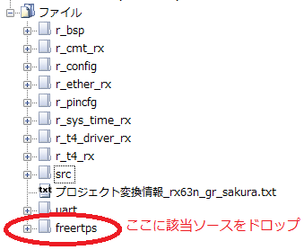

(6) 「ファイル」->「freertps」->「apps」内の以下のディレクトリを除くすべてのディレクトリに対して、「右クリック」->「プロジェクトから外す」を実行してください。

```
rx63n_gr_sakura_joystick
rx63n_gr_sakura_listener
rx63n_gr_sakura_talker
rx63n_gr_sakura_tilt_ctrl
```


(7) 「ファイル」->「freertps」->「systems」内の以下のディレクトリを除くすべてのディレクトリに対して、「右クリック」->「プロジェクトから外す」を実行してください。

```
rx63n_gr_sakura
```

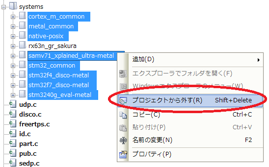

(8) 「ファイル」->「freertps」->「apps」の以下のディレクトリからビルドをするアプリを選択します。ビルド対象のアプリに対してのみ、ディレクトリ上で「右クリック」->「プロパティ」を選択後、「ビルドの対象とする」を「はい」に設定してください。それ以外のディレクトリでは、「いいえ」を設定してください。

```
rx63n_gr_sakura_joystick [Joystick制御アプリ]
rx63n_gr_sakura_listener [文字列"Hello world"の受信アプリ]
rx63n_gr_sakura_talker   [文字列"Hello world"の送信アプリ]
rx63n_gr_sakura_tilt_ctrl[パンチルト台制御アプリ]
```

※以下の例は「文字列"Hello world"の送信アプリ」をビルド対象した場合の例です。

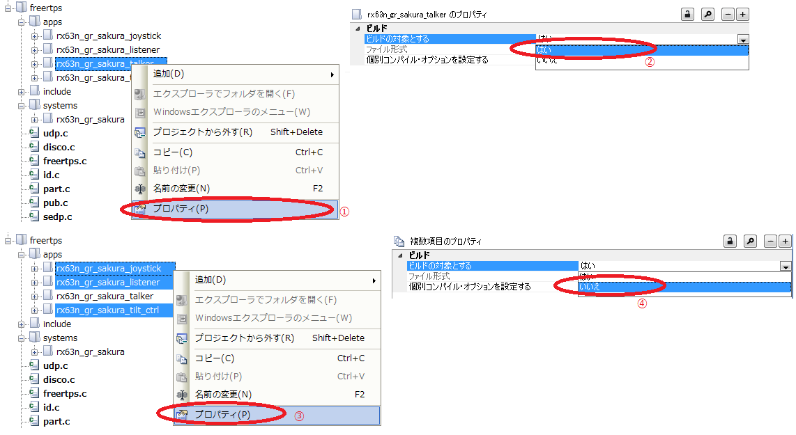

(9) 「CC-RX(ビルド・ツール)」->「共通オプション」のウィンドウ内で「追加のインクルード・パス」に以下を追加してください。

```
%ProjectFolder%/../%ProjectName%/freertps/include
```

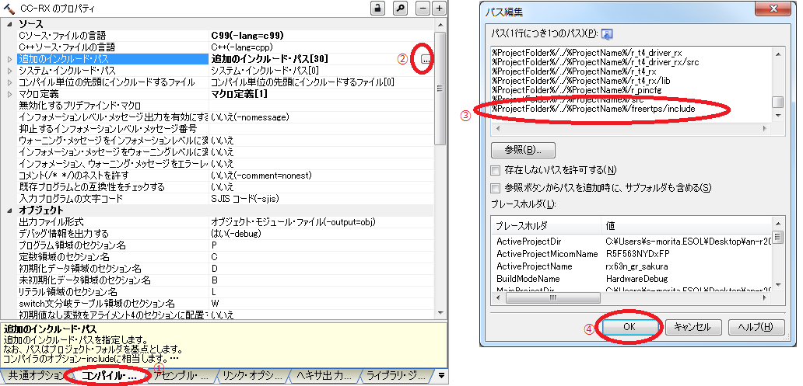

(10) メニューバーから「ビルド」->「ビルド・プロジェクト」をクリックしてください。

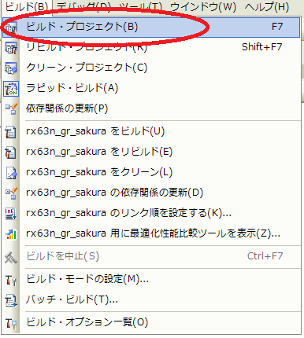

以下が「出力」内に出力されればファームウェアのビルドは成功です。警告は無視してください。

```
------ ビルド終了(エラー:0個, 警告:XX個)(rx63n_gr_sakura, HardwareDebug) ------  
```

ファームウェアの書き込み方法
------------

ファームウェアの書き込みは以下の2通りで行うことができます。

* USB経由での書き込み
* E1 Emulator経由での書き込み

書き込み手順は以下です。

### **\[USB経由での書き込み\]**

(1) SAKURAのスイッチ SW3を「RUN」の反対側にスライドさせます。

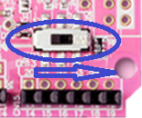

(2) SAKURAをUSB経由でPCと接続します。

(3) SAKURAのRESET SW（SW1：赤いボタン）を押します。

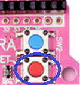

(4) Flash Development Toolkitを起動します。

(5) 「ようこそ！」の画面で、「新規プロジェクトワークスペースの作成」にチェックをした後に、「OK」をクリックします。

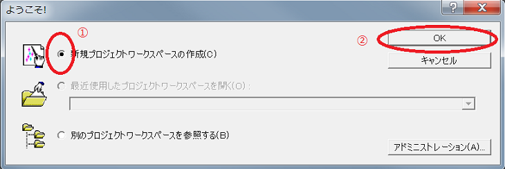

(6) 「新規プロジェクトワークスペース」の画面で、「ワークスペース名」を入力した後に(例: Test)、「OK」をクリックします。

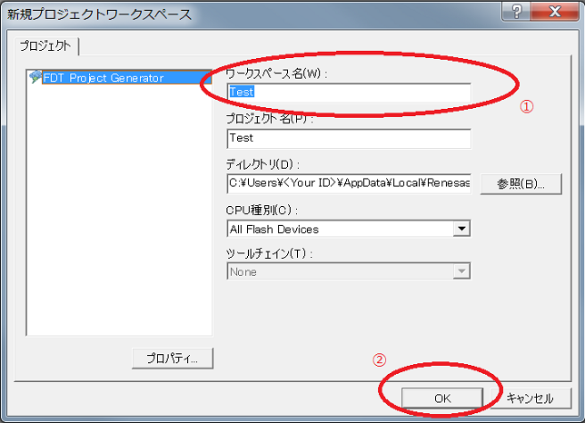

(7) 「デバイスとカーネルの選択」の画面で、「Generic BOOT Device」を選択した後に「次へ」をクリックします。

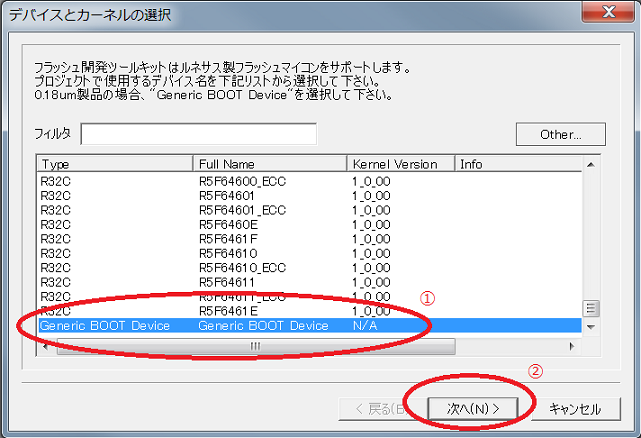

(8) 「通信ポート」の画面で、「Select Port」から「USB Direct」を選択した後に「次へ」をクリックします。

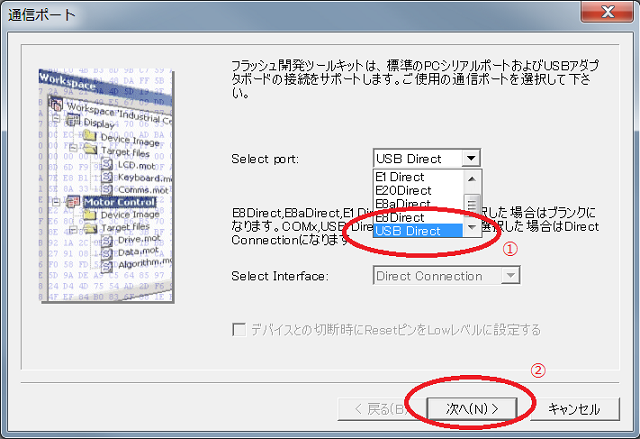

(9) 「FLASH Development Toolkit」の画面で、以下のようなダイアログが出力された場合は、「OK」をクリックします。

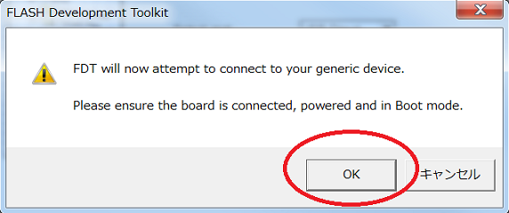

(10) 「Select Device」の画面で、「OK」をクリックします。

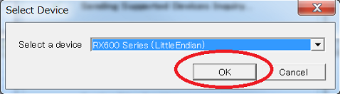

(11) 「汎用デバイスの確認」の画面で、「OK」をクリックします。

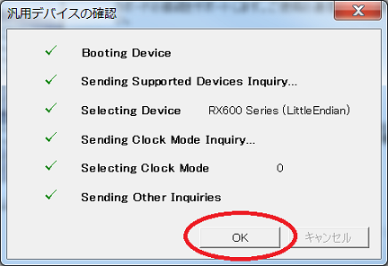

(12) 「デバイス設定」の画面で、「入力クロック」に「12.00」を選択して、「次へ」をクリックします。

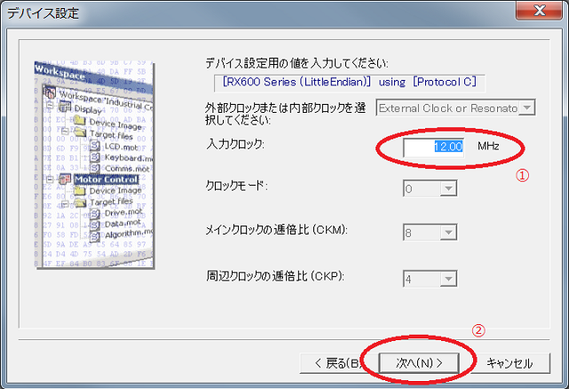

(13) 「書き込みオプション」の各設定項目がそれぞれ以下のようになっていることを確認して、「完了」をクリックします。

* Protection => Automatic
* Messaging => Advanced
* Readback Verification => No

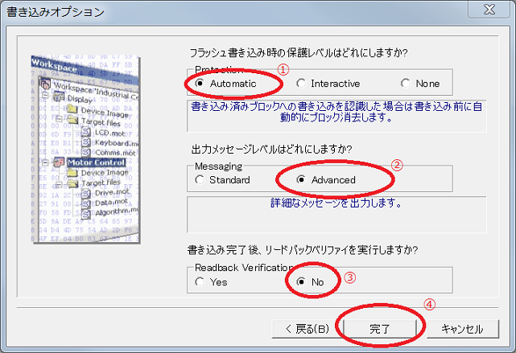

(14) メニュー「ファイル」をクリックし、「データファイルを開く」をクリックします。その後、「データファイルのロード」の画面で、「rx63n_gr_sakura」を選択して、「開く」をクリックしてください。

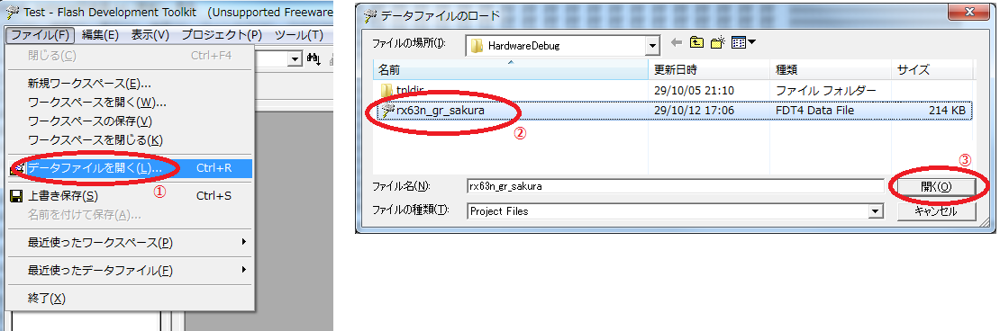

(15) メニュー「デバイス」をクリックし、「対象ファイルのダウンロード」をクリックしてください。

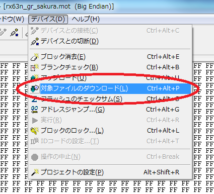

以下の出力されれば書き込み完了です。

```
書き込みが完了しました
```

(16) Flash Development Toolkitを終了します。

(17) SAKURAのスイッチ SW3を「RUN」側に戻します。


### **\[E1 Emulator経由での書き込み\]**
(1) CS+のメニューの「デバッグ」->「使用するデバッグ・ツール」内から「RX E1(JTAG)」をクリックします。

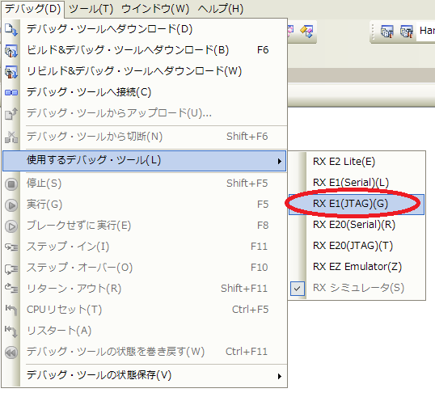

(2) CS+のメニューの「デバッグ」->「デバッグ・ツールへダウンロード」をクリックします。

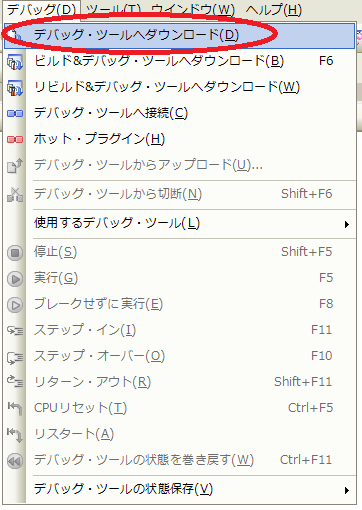

以下のダイアログが出て書き込みに失敗する場合は、「RX E1(JTAG)」の「接続用設定」タブ内の「クロック」->「メイン・クロック・ソース」を「HOCO」に設定して、(2)の手順を再実施してください。

```
ダウンロードに失敗しました。

[エラーの直接原因]
メイン・クロック周波数の値が正しく入力されていません。(E1891713)
```

動作確認
----

### Hello worldデモ

SAKURA間で、文字列用メッセージ型"std_msgs::msg::String"の転送ができることを確認します。
動作確認には受信側のデバッグ・コンソール出力を確認するためは、E1 Emulatorを使ったデバッグコンソールの機能が必要です。

(1) 文字列"Hello world"の送信アプリのみを選択してビルドを行い、SAKURA(Pub)に書き込みます。

(2) 文字列"Hello world"の受信アプリのみを選択してビルドを行い、SAKURA(Sub)に書き込みます。

(3) SAKURA(Pub)に電源を接続します。

(4) E1 Emulatorを接続した状態で、SAKURA(Sub)に電源を接続します。

(5) CS+のメニューの「デバッグ」->「デバッグ・ツールへ接続」をクリックして、SAKURA(Sub)をデバッガに接続します。

(6) CS+のメニューの「デバッグ」->「CPUリセット」をクリックし、そして「デバッグ」->「実行」をクリックして、SAKURA(Sub)を起動させます。

(7) 以下のように出力されると、SAKURA間で文字列転送が成功しています。

```
hello, world!
freertps INFO : udp init()
freertps INFO : ^^>>>user_cb<<< ch:0,eventID = ETHER_EV_LINK_ON
freertps INFO : frudp_generic_init()
freertps INFO : frudp_part_create() on domain_id 0
freertps INFO : frudp_init_participant_id()
freertps INFO : add ucast rx port 7410
....(SNIPPED)....
I heard: [Hello World: 4]
I heard: [Hello World: 5]
I heard: [Hello World: 6]
I heard: [Hello World: 7]
....(SNIPPED)....
```

なお、SAKURA(Pub)とSAKURA(Sub)は、PC Linux上のROS2(Beta2以降)付属デモtalkerとlistenerに代替可能です。代替する場合は以下のコマンドをLinux terminalで実行してください。


\[SAKURA(Pub)の代替\]

```
$ cd <ros2をビルドしたワークスペース>
$ . install/local_setup.bash
$ ros2 run demo_nodes_cpp  talker
```

\[SAKURA(Sub)の代替\]

```
$ cd <ros2をビルドしたワークスペース>
$ . install/local_setup.bash
$ ros2 run demo_nodes_cpp listener_best_effort
```

### Tilt Controlデモ

SAKURA(Pub)がROS2のJoystick用メッセージ型"sensor_msgs::msg::Joy"を送信し、それを受け取ったSAKURA(Sub)がパンチルト台を制御できることを確認します。

(1) Joystick制御アプリのみを選択してビルドを行い、SAKURA(Pub)に書き込みます。

(2) パンチルト台制御アプリのみを選択してビルドを行い、SAKURA(Sub)に書き込みます。

(3) SAKURA(Pub)、SAKURA(Sub)に電源を接続します。

(4) Joystickを操作して、パンチルト台が連動して動いていることを確認します。


パンチルト台について
====

このアプリのために作成したパンチルト台のため購入することはできません。
パンチルト台制御アプリがJoystickの位置情報をモーターの目標角度に変換します。目標位置はSAKURA（Sub)のUARTで送信し、パンチルト台内部でRS485信号に変換し、パンチルト台のサーボモーターを制御します。
SAKURA（Sub)からパンチルト台へのUART通信の接続仕様を以下に示します。このように通信されていれば正しく動作していることになります。


UART仕様 (Serial channel-1, P20/TXD0, P21/RXD0)
Baud rate: 1M bps
Data format: 8-b data, 1-b stop bit, no parity, no flow control

制御コマンド仕様 (send only)
Byte
1st header 0xFF (fixed)
2nd header 0xFF (fixed)
3rd motor ID (0x01:x 0x02:y)
4th 0x1E (fixed) 
5th 目標角度（lowest byte）
6th 目標角度（highest byte）

目標角度は2048（直立）+/-218 の範囲で指定されます。

使用モーター
Dynamixel MX-64AR
http://support.robotis.com/en/product/actuator/dynamixel/mx_series/mx-64at_ar.htm


連絡
===
ROS Discourseにスレッドを立てる予定です。


制限事項
====

* freertpsのAPI frudp_listen()の引数である時間間隔の精度は1秒単位です。1秒より短い時間間隔が必要な場合は"0.0f"を設定してください。
* PC上のROS2への接続確認は、ミドルウェアとしてFast-RTPSを使っている環境でのみ行っています。他のミドルウェアへの接続は未確認です。


